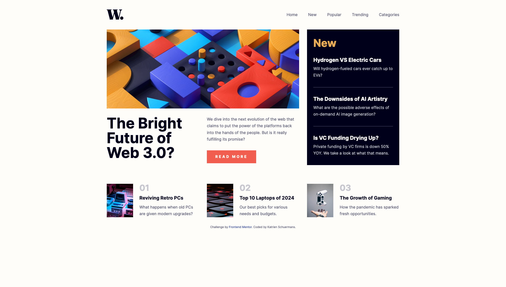

# Frontend Mentor - News homepage solution

This is a solution to the [News homepage challenge on Frontend Mentor](https://www.frontendmentor.io/challenges/news-homepage-H6SWTa1MFl). Frontend Mentor challenges help you improve your coding skills by building realistic projects. 

## Table of contents

- [Overview](#overview)
  - [The challenge](#the-challenge)
  - [Screenshot](#screenshot)
  - [Links](#links)
- [My process](#my-process)
  - [Built with](#built-with)
  - [Continued development](#continued-development)
  - [Useful resources](#useful-resources)
- [Author](#author)

## Overview

### The challenge

Users should be able to:

- View the optimal layout for the interface depending on their device's screen size
- See hover and focus states for all interactive elements on the page

### Screenshot

### Links

- Solution URL: [Github](https://github.com/graficdoctor/fe-24-007-news-homepage)
- Live Site URL: [Vercel](https://fe-24-007-news-homepage.vercel.app/)

## My process

### Built with

- Semantic HTML5 markup
- CSS custom properties
- Flexbox
- CSS Grid
- Mobile-oriented workflow

### Continued development

- Learn Accessibility
- For this exercise more specifically: Accessibility and hamburger-navigation

### Useful resources

- [The Surprising Truth About Pixels and Accessibility](https://www.joshwcomeau.com/css/surprising-truth-about-pixels-and-accessibility/) This is an article by Josh Comeau on when using px and rem/em. 
- [How To Build An Animated Hamburger Menu With Only CSS](https://www.youtube.com/watch?v=dAIVbLrAb_U&t=1s) I was happy with how I'd solved the hambuger-menu. But when I looked into how to add accessibility, I realised the method I've set up, is not A11y at all. I'll be updating this later.

## Author

- Website - [Katrien Schuermans](https://www.katriens.be)
- Frontend Mentor - [@graficdoctor](https://www.frontendmentor.io/profile/graficdoctor)
- Twitter - [@graficdoctor](https://www.twitter.com/graficdoctor)
